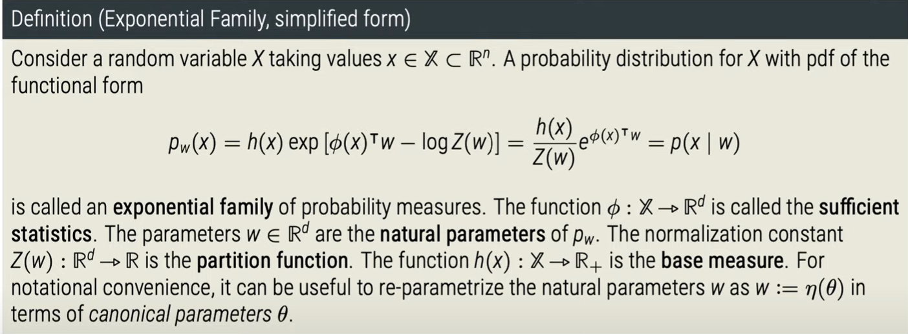
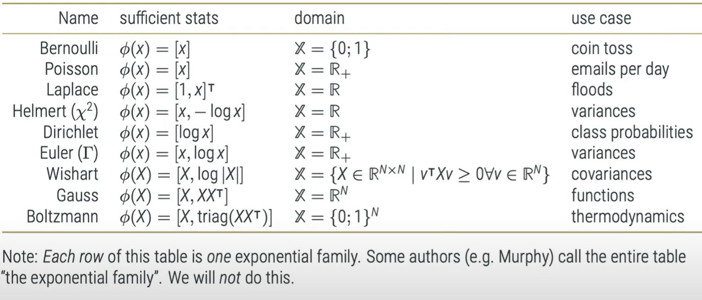

# Definition
- Consider a random variable X taking values $x \in \mathcal{X} \subset \mathcal{R}^n$. A probability distirbution for X with pdf of the functional form
  $p_w (X) = h(x) exp [\phi(X)^T W - log Z(w)] = \frac{h(X)}{Z(w)}e^{\phi(x)^T * w } = p(x|w)$
  is called an **exponentail family** of probability measures.
  The function $\phi : \mathcal{X} \rightarrow \mathcal{R}^d$ is called the **sufficient statistics**. 
  The parameters $w \in \mathcal{R}^d$ are the **natural parameters** of p_w. The normalization constant $Z(w): \mathcal{R}^d \rightarrow R$ is partition function. 
  The function $(h(x):\mathcal{X} \rightarrow \mathcal{R}_{+}$ is the **base measure**. 
  For notational convenience, it can be useful to re-parametrize the natural parameters w as $w:=\eta(\theta)$ in terms of canonical parameters \theta
- Conjugate Priors allow analytic inference in probablistic models
- Exponentail Families guarantee the existence of conjugate priors, although not always tractable ones
- the Hardest part is finding the normalization constant. In fact, finding the normalization constant is the only hard part.
- Exponential famielies are a way to turn someones else's integral into an inference algorithm!
- For a long time, exponentail famielies were the only way to do tractable Bayesian inference. In a way the essence of machine learning is to use computers to break free from exponential families.
- 
- 
- $P_w(x)$ - Probability distributions over some data $x$ -> these are likelihoods paratremized by $w$
-
- # Sources
- {{video https://www.youtube.com/watch?v=GM7coty_Xqg&t=857s}}
- {{video https://www.youtube.com/watch?v=xwM9XcnQ4Us}}