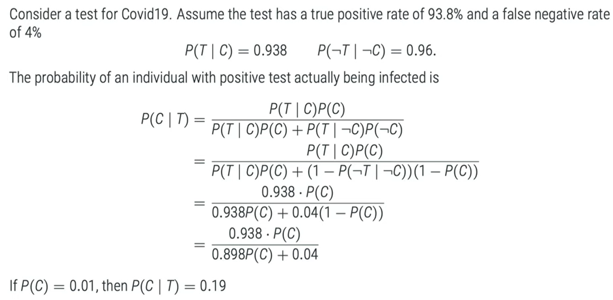
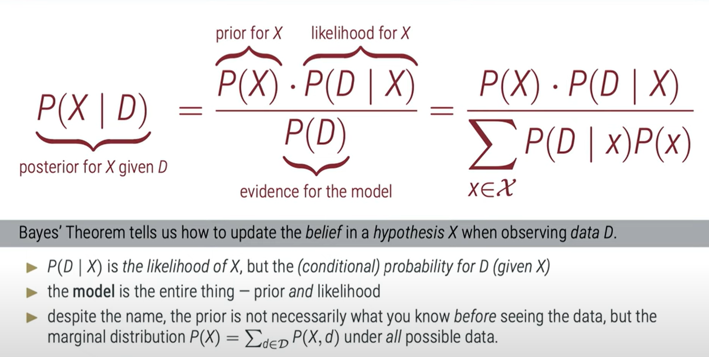
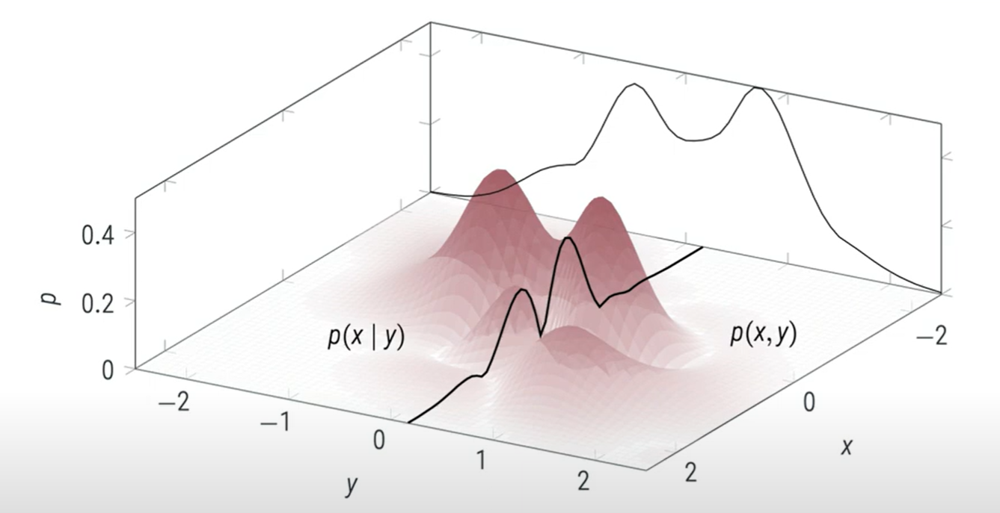
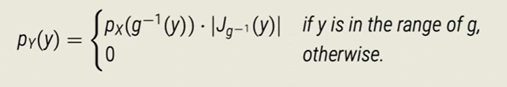

### Inference problem
	- An inference problem requires statements about the value of an unobserved (latent) variable X based on observations y which are related to x, but may not be sufficient to fully determine x. This requires a notation of uncertainty
	-
- Keywords / Glossary :
	- Observed, Observations - data etc.
	- Unobserved (latent) - hypothesis - latent quantity etc.
- Notes
	- This kind of reasoning is computably expensive, so it is common to use approximations, tricks and tricks.
- Baysian Teorem
	- $P(A|B)=\frac{P(B|A)P(A)}{P(B|A)P(A) +P(A|~B)P(~B)}$
	- P(A|B) - Posterior probability, so probability after seeing observations. Result of inference?
	- P(A) - Prior - probability of event before inference e.g. How often someone is ill with covid? It is unconditioned.
	- P(B|A) - Likelihood - conditional probability of an event given observations. e.g. How probable is to have covid given a positive test.
	- Denominator - where we relate probabilities with all possible observations of the data. So it is a normalization based on all possibilities.
	- 
- ### Probability axioms (Kolmogorov axioms)
	- What are axioms?
		- These axioms are foundations of probability theory introduced by Andrey Kolmogorov in 1933
		  Axioms are fundamental principles or statements taken to be true without requiring proof within a particular system of thought of field of study. They serve as starting point or foundational concepts upon which other propositions and theorems are built.
	- Defintions:
	  A - Event
	  P(A) - function of probability/occurance of event A
	  \Omega / E- All possible outcomes
	  F - event space - all possible events
	  Not that events are not outcomes of events.
	-
	- Axiom 1 - Non-Negativity
	  The probability of an event is a non-negative real number. 
	  P(A) \in $\mathcal{R}$, P(A) > 0,  \forall A \in F \]
	- Axiom 2 - Normalization
	  P(\Omega) = 1
	  This assumption of unit measure: The probability that at least one of the elementary events in the entire sample space will occur is 1. 
	  That means that probability that any of the events from sample space occur is 1.
	- Axiom 3 - Additivity
	  If we have a sequence of mutually exclusive events (events that cannot occur simultaneusly), then the probability of the union of these events is equal to the sum of their individual probabilities. Mathematically if A_1, A_2, A_3... are mutually exclusive events then the probability of their union is 
	  $P\left(\bigcup_{i=1}^{\infty} A_i\right) = \sum_{i=1}^{\infty} P(A_i)$
	- Why do we need them?
	- \sigma-algebra - TODO
	- de Morgan's Law - TODO
	- Theorem (Sum Rule)
	  From A + ~A = E we get
	  P(A) + P(~A) = P(E) = 1, thus P(A) = 1 - P(~A)
	  Any from:
	  A = A \cap (B+~B), using the notation P(A,B) = P(A \cap B) for the joint probability of A and B, we get the Sum Rule: 
	  P(A) = P(A,B) + P(A,~B)
	- Definition (Conditional Probability)
	  If P(A) > 0, the quotient: 
	  P(B|A) = P(A,B) / P(A)
	  and it gives
	  P(A,B) = P(B|A)P(A) = P(A|B)P(B)
	- Theorem (Law of total probability)
	  The Law of Total Probability is a fundamental principle in probability theory that provides a way to compute the probability of an event by considering all possible ways the event could occur, each weighted by its respective probability. It is often used when dealing with compound events or when the occurrence of one event depends on the occurrence of another.
	  \[ P(A) = \sum_{i} P(A \cap B_i) \]
	  \[
	  P(A) = \sum_{i} P(A \cap B_i)
	  \]
	  where:
	  𝑃(𝐴)*P*(*A*) is the probability of event 𝐴*A*,
	  𝐵1,𝐵2,...,𝐵𝑛*B*1​,*B*2​,...,*B**n*​ are mutually exclusive and exhaustive events (meaning that they cover all possible outcomes and do not overlap), and
	  𝑃(𝐴∩𝐵𝑖)*P*(*A*∩*B**i*​) is the probability of event 𝐴*A* occurring given that event 𝐵𝑖*B**i*​ has occurred, multiplied by the probability of event 𝐵𝑖*B**i*​ occurring.
	  In simpler terms, it says that the probability of 𝐴*A* happening is the sum of the probabilities of 𝐴*A* happening given each possible condition (events 𝐵1,𝐵2,...,𝐵𝑛*B*1​,*B*2​,...,*B**n*​), each multiplied by the probability of that condition occurring.
	  The Law of Total Probability is often used in conjunction with conditional probability to find the probability of an event when information about related events is known. It helps in breaking down complex probability problems into simpler, more manageable parts.
	- Theorem (Payes Theorem)
	  Bayes' theorem, named after the Reverend Thomas Bayes, is a fundamental concept in probability theory and statistics. It provides a way of updating probabilities based on new evidence or information. The theorem is particularly useful in situations where we want to determine the probability of an event given some prior knowledge and new data.
	  Mathematically, Bayes' theorem can be expressed as:
	- \[ P(A|B) = \frac{P(B|A) \times P(A)}{P(B)} \]
	  
	  Where:
	- \( P(A|B) \) is the probability of event A occurring given that event B has occurred.
	- \( P(B|A) \) is the probability of event B occurring given that event A has occurred.
	- \( P(A) \) and \( P(B) \) are the probabilities of events A and B occurring independently of each other.
	- In words, Bayes' theorem states that the probability of event A given event B is proportional to the
		- probability of event B given event A, multiplied by the prior probability of event A
		- and normalized by the probability of event B.
	- Bayes' theorem has applications in various fields, including medical diagnosis, spam filtering, machine learning, and even philosophy. It provides a formal framework for updating beliefs or hypotheses in light of new evidence, making it a powerful tool for decision-making under uncertainty.
	- 
	-
- How does it related to Machine learning
	- Statistical Learning Theory
	- Probabilistic Learning
- Definiotion (Independence)
  Two variable A and B are independent, if and only if their joint distributions factorizes into so-called marginal distributions, i.e 
  P(A,B) = P(A)P(B)
  In that case P(A|B) = P(A) Notation $A\perp\!\!\!\perp B$. Information about B does not give information about A and vice versa.
-
- Computing with Probabilities
	- Probablistic reasoning extends propositional logic
	- Instead of tracking a single true value, we have to assign probabilities to combinatorially many hypotheses
	- Two variables A and B are conditionally independent given variable C if and only if their conditional distribution factorizes
	  P(A,B|C) = P(A|C)P(B|C)
- #BayesianNetwork
- #[[The Banach-Tarski Paradox]]
- Definition (Topology)
  Let \Omega be a space and \tau be a collection of sets. We say \tau is a topology on \Omega if
	- \Omega \in \tau and \empty \in \tau
	- any union of elements of \tau is in \tau
	- any intersection of finitely many elements of \tau is in \tau
- The lements of the topology \tau are called **open sets**. In the Euclidean vector space \mathcal{R}^d, the canonical topology is that of all sets $U$ that statisfy $x \in U :\Rightarrow \exists_\epsilon > 0 : ((||y-x|| < \varepsilon) \Rightarrow (y \in U))$
- Random Variables allow us to define derived quantities from atomic events
- Borel \sigma -algebras can be defined on all topological spaces, allowing us to define probabilities if the elementary space is contiunous
- Note the connection to computability theory: **measurable** functions and **computable** functions. 'Not all sets are measurable", and "not all languages are computable'".
- Definition (Cumulative Distribution Function (CDF))
	- Let \mathcal{B} be the Borel \sigma - algebra in \mathcal{R}^d . For probability measures P on (\mathcal{R}^d, \mathcal{B}), the cumulative distribution function is the function 
	  $F(x)=P(\prod_{i=1}^{d}  (X_i < x_i))$
	- In particular for the univariate case d=1, we have F(x) = P((-\infty,x]).
	- In multi dimensional problems we can multiply these volumes.
	- 
-
- Definition (Probability Density Functions (pdf's))
	- A probability measure P on $(\mathcal{R}^d,\mathcal{B})$ has a density p if p is a non-negative (Borel) measurable function on \mathcal{R}^d satisfying, for all $B \in \mathcal{B}$
	- $P(B) = \int_{B} p(x) dx =: \int_{B} p(x1,...,x_d) dx_1 ... dx_d$
	- In particular, if the CDF F of P is sufficiently differentiable, then P has a density, given by 
	  $p(x) = \frac{\delta^d F}{\delta x_1 ... \delta x_d}|_x$
	- and, for d=1 (one dimension)
	  $P(a<=X <b) = F(b) - F(a) = \int_a^b f(x) dx$
- Densities Satifsy the Laws of Probability Theory
	- For probability densities p on $\mathcal{R},B$ we have
	  $P(E)= 1 = \int_{R^d} p(x) dx$
	- Let X = (X_1, X_2) \in R^2 be a random variable with density p_x on \mathcal{R^2}. Then the **marginal densities** of X_1 and X_2 are given by the **sum rule**
	  $p_{x_1} (x_1) = \int_{ \mathcal{R} } p_x (x_1, x_2) dx_2$ , $p_{x_2} (x_2) = \int_{ \mathcal{R} } p_x (x_1, x_2) dx_1$
	- The **conditional density** p(x_1 | x_2) for P(x_2) >0 is given by the **product rule**
	  $p(x_1|x_2) = \frac{p(x_1,x_2)}{p(x_2}$
	- Bayes' Theorem holds:
	  $p(x_1|x_2) = \frac{p(x_1)*p(x_2|x_1)}{\int p(x_1) * p(x_2|x_1) dx_1}$
	- Rabbit hole - Conditional Densities
	  
	- This black line that starts on y near 0 is : "Given y is this, x is distributed that way"
	- The background plot is sum of these distributions.
- Theorem (Change of Variable for Probability Density Functions)
  Let X be a continuous random variable with PDF px(X) over c_1 < x < c_2. And, let Y = u(X) be a monotonic differentiable function with inverse X = v(Y). Then the PDF of Y is:
  $p_y(y)=p_x(v(y))* |\frac{dv(y)}{dy} = p_x (v(y)) * |\frac{du(x)}{dx}|^-{1}$
- Theorem (Transformation Law, general)
  Let X = (X_1,....,X_d) have a joint density p_x. Let g: \mathcal{R}^d \rightarrow \mathcal{R}^d be continously differentiable and injective, with non-vanishing Jacobian J_g. Then Y = g(X) has density
  
  The Jacobian J_g is the d x d matrix with
  $[J_g(x)]ij = \frac{\delta g_i(x)}{\delta x_j}$
- Github for lecture: https://github.com/philipphennig/ProbML_Apps
- #BetaInference
- Definition (Conjugate Pri)